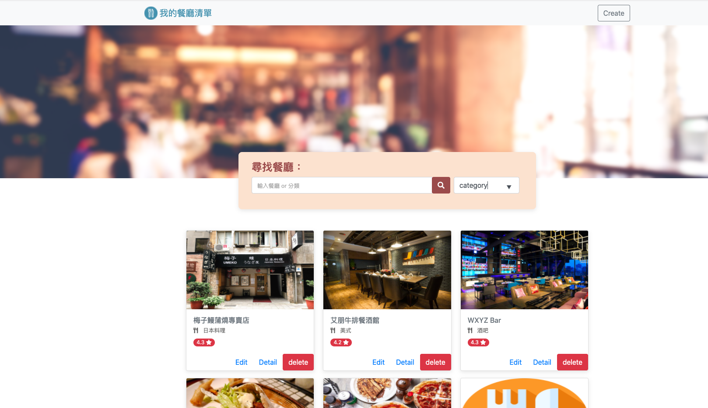

# 我的餐廳清單


## Description

This is a website created by node.js Express. 
- Search restaurants by name or category.
- Login to save your restaurants
- Facebook Login allowed
- Add a restaurant
- Check details of a restaurant
- Browse all restaurants
- Modify a restaurant information
- Delete a restaurant from list

### Executing program

1. Open terminal and git clone
```
git clone https://github.com/wenrou77/restaurant_list.git
```

2. Initialization
```
npm install  //install packages
```

3. Execute
- To add data seeders
```
npm run seed
```

- To run on the index page
```
npm run dev
```
- Login using test account
email: 'user1@example.com',
password: '12345678'

## Authors

Wendy (wendy@gmail.com)
